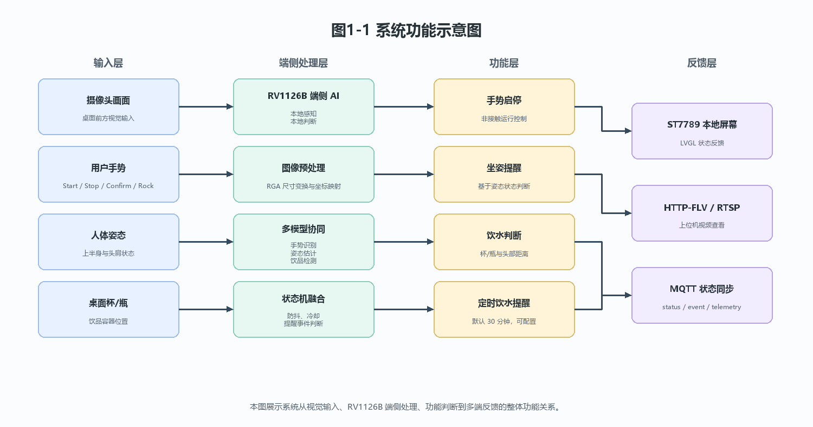
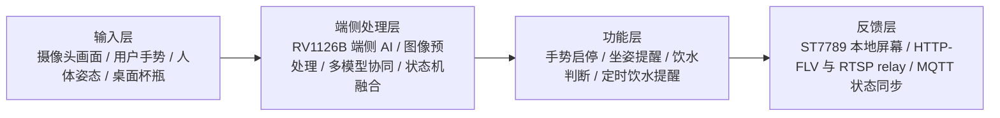

# 图1-1 系统功能示意图

图注：
本图展示系统从视觉输入、RV1126B 端侧处理、功能判断到多端反馈的整体功能关系。

文件说明：
- SVG 矢量图：`fig1_1_system_function.svg`
- PNG 位图：`fig1_1_system_function.png`
- 图中上位机仅作为视频查看和 MQTT 订阅端，不作为 AI 推理节点。

Mermaid 备份：

