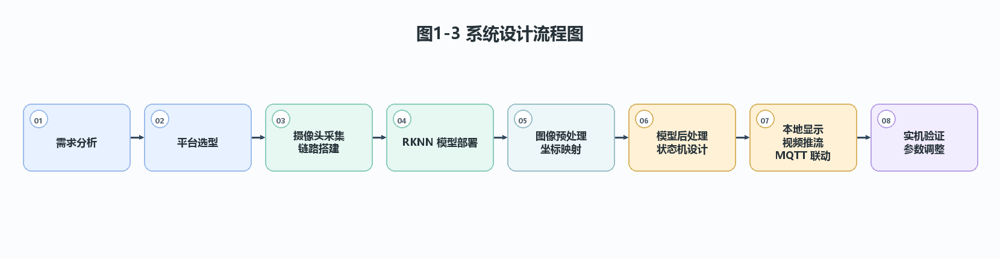

# 图1-3 系统设计流程图

文件说明：
- SVG 矢量图：`fig1_3_design_flow.svg`
- PNG 位图：`fig1_3_design_flow.png`
- 本图表示从需求分析到实机验证与参数调整的设计路线，不表示性能测试已经完成。

Mermaid 备份：

```mermaid
flowchart LR
    A["需求分析"] --> B["平台选型"]
    B --> C["摄像头采集链路搭建"]
    C --> D["RKNN 模型部署"]
    D --> E["图像预处理与坐标映射"]
    E --> F["模型后处理与状态机设计"]
    F --> G["本地显示、视频推流与 MQTT 联调"]
    G --> H["实机验证与参数调整"]
```
