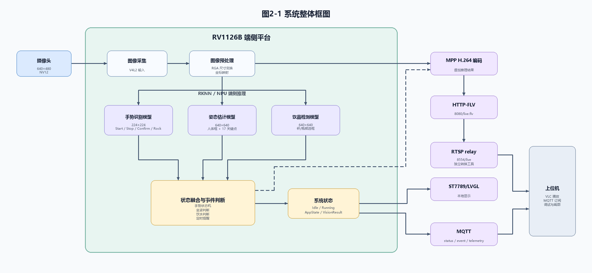

# 图2-1 系统整体框图

本图用于第二部分系统整体介绍，展示摄像头输入、RV1126B 端侧平台内部处理、HTTP-FLV/RTSP relay 视频链路、MQTT 状态同步链路以及上位机查看关系。图中不包含底部说明文字，正式文档插图时可直接使用 SVG 或 PNG 文件。

文件：
- `fig2_1_system_overview.svg`
- `fig2_1_system_overview.png`
- `generate_fig2_1_system_overview.py`
