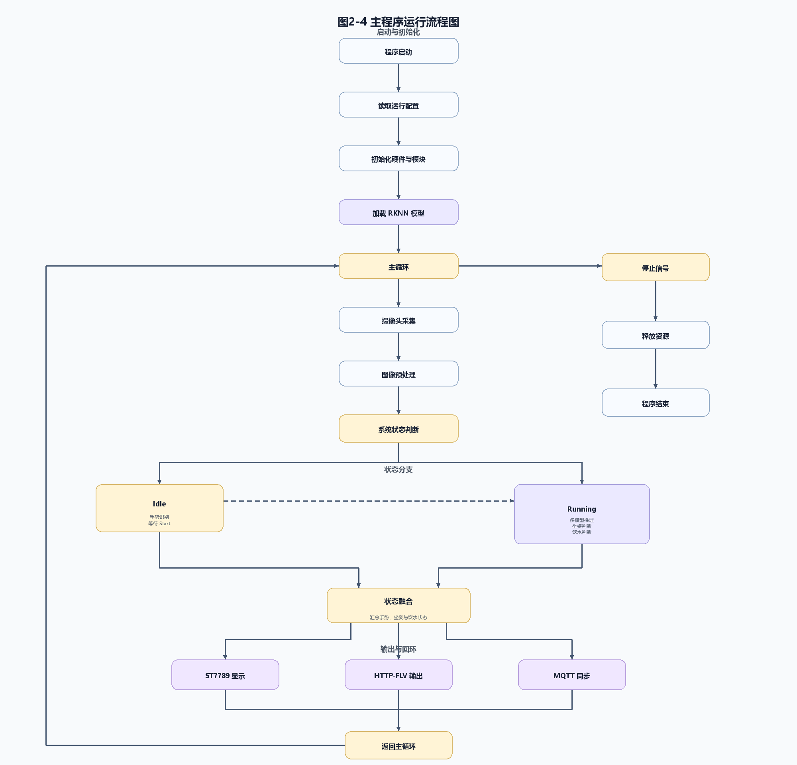

# 图2-4 主程序运行流程图

本图用于第二部分 2.3.1 软件整体架构之后，展示主程序从启动、配置读取、模块初始化、模型加载到主循环运行的整体流程，并区分 Idle 与 Running 两类业务状态。图中统一表达 ST7789 显示、HTTP-FLV 输出和 MQTT 同步后的主循环回环，不包含底部图注。

文件：
- `fig2_4_main_program_flow.svg`
- `fig2_4_main_program_flow.png`
- `generate_fig2_4_main_program_flow.py`
- `fig2_4_main_program_flow_self_check.md`
