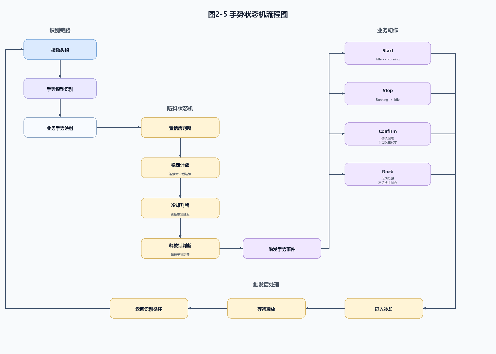

# 图2-5 手势状态机流程图

本图用于第二部分 2.3.4 手势识别与交互控制，展示手势识别结果经过业务映射、置信度判断、稳定计数、冷却判断和释放锁判断后，才触发 Start、Stop、Confirm 或 Rock 事件。图中不包含底部图注，可直接在正式文档中引用 SVG 或 PNG。

文件：
- `fig2_5_gesture_state_machine.svg`
- `fig2_5_gesture_state_machine.png`
- `generate_fig2_5_gesture_state_machine.py`
- `fig2_5_gesture_state_machine_self_check.md`
