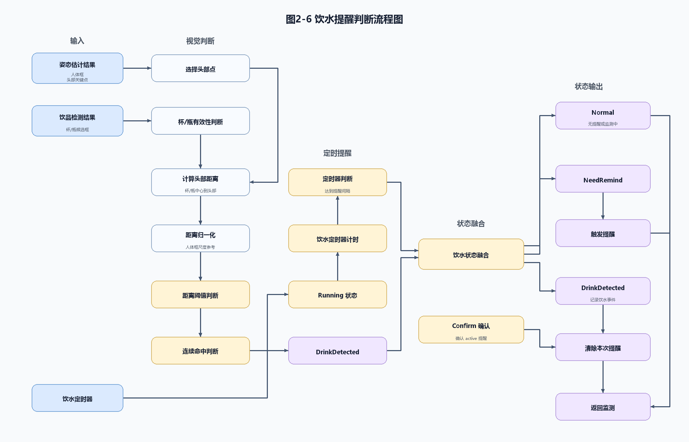

# 图2-6 饮水提醒判断流程图

本图用于第二部分 2.3.6 饮品检测与饮水提醒，展示姿态估计、饮品检测和饮水定时器共同参与饮水状态判断的流程。图中不包含底部图注，可直接在正式文档中引用 SVG 或 PNG。

文件：
- `fig2_6_drink_reminder_flow.svg`
- `fig2_6_drink_reminder_flow.png`
- `generate_fig2_6_drink_reminder_flow.py`
- `fig2_6_drink_reminder_flow_self_check.md`
