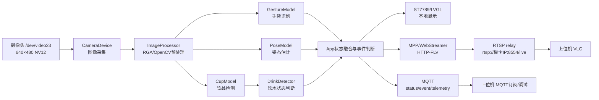
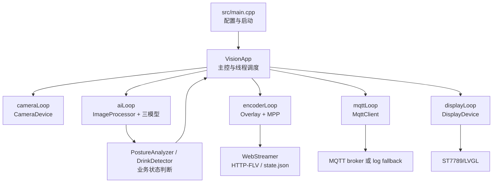
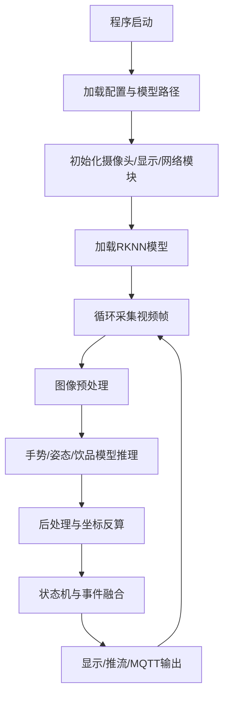

# 作品名称

基于 RV1126B 的端侧视觉健康守护系统

# 摘要

学生自习和办公桌面场景中，久坐、坐姿不良和饮水提醒不足等问题较为常见，传统定时提醒或单一传感方式难以结合用户当前状态进行反馈。本作品基于 RV1126B 端侧 AI 平台设计视觉健康守护系统，面向桌面场景实现本地感知、本地判断和多端反馈。系统以摄像头作为主要输入，采集 640×480 NV12 视频帧，经 RGA/OpenCV 图像预处理后，分别送入手势识别、姿态估计和饮品检测模型进行 RKNN 端侧推理。软件侧通过 App 主控模块组织 CameraDevice、ImageProcessor、GestureModel、PoseModel、CupModel、DrinkDetector 等模块，并结合状态机完成手势启停、坐姿状态判断、饮水状态判断和定时饮水提醒。当前主程序饮品检测采用 BottleBoxesOnly 配置，模型不输出类别，检测结果以 `bottle(box_only)`、`class_id=-1` 的形式参与后续判断；系统也保留 COCO class-aware 配置支持。输出侧代码中配置了 ST7789 240×240 屏幕和 LVGL 显示状态，覆盖待机、运行、手势反馈、坐姿提醒和饮水提醒等界面，实际提醒显示效果需结合第三部分照片验证；视频链路由主程序输出 HTTP-FLV，并由独立 RTSP relay 转换为 VLC 可播放地址；通信链路支持 MQTT 发布状态、事件和遥测信息。作品不依赖云端识别，重点体现 RV1126B 端侧推理、多模型协同、状态机防抖、视频推流和本地显示的工程闭环，可用于桌面学习、办公提醒以及嵌入式端侧 AI 综合应用展示。

# 第一部分  作品概述

## 1.1 功能与特性

本作品围绕桌面学习和办公场景，构建从视觉采集到本地反馈的端侧 AI 系统。系统当前实现的功能包括摄像头采集、手势启停、坐姿监测、饮品检测、视觉饮水判断、定时饮水提醒、本地屏幕反馈、视频查看和状态同步。

- 摄像头采集：当前主程序使用 `/dev/video23`，采集 640×480 NV12 图像作为视觉输入。
- 手势启停：支持 Start、Stop、Confirm、Rock 等手势，并通过稳定计数、冷却和释放机制减少误触发。
- 坐姿监测：基于人体框和 17 个关键点识别头部前伸、低头、后仰等异常坐姿状态。
- 饮水提醒：结合头部关键点与杯/瓶位置进行视觉判断，并支持默认 30 分钟的定时饮水提醒。
- 本地反馈：代码中通过 ST7789 240×240 屏幕和 LVGL 配置待机、运行、手势、坐姿和饮水提醒等显示状态。
- 视频与通信：主程序输出 HTTP-FLV 视频流，RTSP relay 转换为 VLC 可播放地址，并支持 MQTT 状态同步。

## 1.2 应用领域

本作品主要面向三类场景。第一类是学生自习场景，系统可放置在学习桌面，通过摄像头观察用户上半身和桌面区域，以非接触手势启动或暂停监测，并对坐姿和饮水状态进行提示。第二类是办公桌面场景，系统可作为桌面端侧提醒设备，在不依赖云端识别的情况下完成本地视觉判断，通过小屏幕、视频流和 MQTT 状态同步提供反馈。第三类是嵌入式 AI 教学、竞赛和系统展示场景，项目覆盖摄像头采集、RKNN 模型部署、图像预处理、状态机、本地显示、视频推流和 MQTT 通信，适合作为端侧 AI 综合工程案例。

本作品定位为坐姿与饮水提醒系统，不作为医疗诊断设备使用。

## 1.3 主要技术特点

本作品的技术特点体现在端侧推理和系统集成两个方面。硬件平台采用 RV1126B，模型推理侧通过 RKNN 部署手势、姿态和饮品检测模型，面向本地 NPU 推理链路设计。图像预处理模块支持 RGA 和 OpenCV 路径，将摄像头帧转换为各模型所需输入尺寸，并记录坐标映射信息。业务层不是简单显示模型输出，而是通过多模型协同和状态机融合手势、人体关键点、杯/瓶位置和定时器事件，实现启停控制、坐姿提醒和饮水提醒。交互与输出层采用 ST7789/LVGL 本地显示状态映射，结合 MPP 编码、HTTP-FLV 输出和独立 RTSP relay 提供视频查看能力，并通过 MQTT 发布状态和事件信息，形成端侧感知、判断与反馈闭环。

## 1.4 主要性能指标

以下仅列源码和配置中可确认的实现参数，未列入未实测性能数据。

| 参数类别 | 指标 | 当前实现 | 备注 |
| ---- | -- | ---- | -- |
| 摄像头输入 | 分辨率与格式 | 640×480，NV12 | `/dev/video23` |
| 手势模型 | 输入尺寸 | 224×224 | `model/yolov5_gesture_rv1126b.rknn` |
| 姿态模型 | 输入尺寸 | 640×640 | `model/yolov8n-pose-rv1126b-i8.rknn` |
| 饮品模型 | 输入尺寸 | 640×640 | 当前主程序为 BottleBoxesOnly |
| 显示屏 | 屏幕规格 | ST7789，240×240 | LVGL 显示，实机状态照片待补 |
| 视频输出 | HTTP-FLV | `8080/live.flv` | 主程序输出 |
| RTSP 输出 | RTSP relay | `8554/live` | 单独可执行程序转换 |
| MQTT 主题 | 状态与事件 | `rv1126b/status`、`rv1126b/event`、`rv1126b/telemetry` | 真实发布需 broker 支持 |
| 饮水提醒 | 定时间隔 | 默认 30 分钟 | 可配置 |

## 1.5 主要创新点

- 构建端侧多模型协同的桌面健康提醒闭环，将手势、姿态和饮品检测结果统一到状态机中处理。
- 采用非接触手势交互，并通过稳定计数、冷却和释放机制降低误触发风险。
- 将视觉饮水判断与定时饮水提醒融合，兼顾当前画面状态和时间提醒逻辑。
- 结合 ST7789 本地显示、HTTP-FLV/RTSP 视频查看和 MQTT 状态同步，实现多端反馈。
- 以模块化方式组织采集、预处理、推理、显示、推流和通信，便于端侧平台部署和调试。

## 1.6 设计流程

本作品设计流程为：需求分析 → 平台选型 → 摄像头采集链路搭建 → RKNN 模型部署 → 图像预处理与坐标映射 → 模型后处理与状态机设计 → ST7789 显示、视频推流和 MQTT 通信联调 → 实机测试与参数优化。整体流程从桌面场景需求出发，逐步完成硬件输入、端侧推理、业务判断和多端反馈链路。

# 第二部分  系统组成及功能说明

## 2.1 整体介绍

本系统面向桌面学习和办公场景，由 RV1126B 主控平台、摄像头输入、端侧 AI 推理、业务状态融合、本地显示、视频推流和 MQTT 通信模块组成。系统的核心数据流从摄像头采集开始，CameraDevice 通过 V4L2 读取 `/dev/video23` 的 640×480 NV12 视频帧，ImageProcessor 将原始帧按模型输入尺寸进行 resize 预处理，并记录坐标映射关系。预处理后的图像分别送入 GestureModel、PoseModel 和 CupModel，完成手势识别、人体姿态估计和饮品检测。

控制流由 App 主控模块统一调度。系统处于 Idle 状态时主要运行手势识别，用于等待 Start 手势；进入 Running 状态后，姿态模型、饮品检测模型和饮水状态判断模块协同工作。App 将手势事件、坐姿状态、饮水状态和定时提醒结果融合为统一的 AppState 与 VisionResult，再分发到 ST7789/LVGL 本地显示、HTTP-FLV 视频输出、独立 RTSP relay 以及 MQTT 状态同步链路。该系统不是单一模型演示，而是包含采集、预处理、RKNN 推理、状态机判断和多端输出的端侧视觉健康守护系统。

图2-1 系统整体框图

## 2.2 硬件系统介绍

### 2.2.1 硬件整体介绍

硬件系统以 RV1126B 平台为主控，负责摄像头采集、图像预处理、RKNN 模型推理、业务逻辑判断以及显示和网络输出。摄像头作为主要视觉输入，当前代码配置的设备节点为 `/dev/video23`，输入分辨率为 640×480，图像格式为 NV12。ST7789 显示屏用于本地状态反馈，当前配置分辨率为 240×240，并通过 LVGL 绘制待机、运行、手势反馈、坐姿提醒和饮水提醒等状态页面；实际接线和各状态显示照片需在第三部分补充。网络连接用于 HTTP-FLV 视频访问、RTSP relay 播放链路以及 MQTT 状态同步。上位机主要承担 VLC 播放、MQTT 订阅、运行日志查看、截图整理和调试验证等工作，不承担 AI 推理。

表2-1 硬件组成表

| 硬件模块 | 作用 | 关键参数/接口 | 备注 |
| ---- | -- | ------- | -- |
| RV1126B 平台 | 系统主控，负责采集、端侧推理、状态判断和多端输出 | RKNN、RGA、MPP、网络、SPI/GPIO 等平台能力 | 具体开发板型号以实物材料为准 |
| 摄像头模块 | 获取用户上半身和桌面饮品区域画面 | `/dev/video23`，640×480，NV12 | 代码使用 V4L2 MPLANE/MMAP 采集 |
| ST7789 显示屏 | 本地显示待机、运行、手势和提醒状态 | 240×240，当前配置 `/dev/spidev1.0` | DC=128、RESET=23、背光=-1 需结合实机接线核对 |
| 网络连接 | 视频访问、RTSP relay 和 MQTT 通信 | HTTP-FLV 8080，RTSP relay 8554，MQTT 可配置 | 真实 MQTT 发布需要 broker 和 libmosquitto 支持 |
| 上位机 | VLC 播放、MQTT 订阅、日志查看和截图整理 | VLC、MQTT 客户端、终端工具 | 不作为云端识别或推理节点 |

### 2.2.2 机械设计介绍

当前项目以桌面摆放式结构为主要形态，没有在代码或资料中体现复杂机械结构、CAD 外壳或自研机加工部件。RV1126B 开发板、摄像头、ST7789 显示屏和网络连接组成桌面演示系统，摄像头朝向用户，使视场覆盖用户头肩区域以及桌面上的杯子或水瓶区域；ST7789 显示屏朝向用户，便于在不查看上位机的情况下获得当前系统状态和提醒反馈。

这种桌面摆放式结构便于比赛演示和功能调试，也便于根据不同桌面环境调整摄像头角度和显示屏朝向。后续实物展示中应通过照片说明固定方式、摄像头视场和屏幕朝向，不将未完成的外壳、CAD 或机械加工内容写成既有成果。

### 2.2.3 电路各模块介绍

当前项目资料未体现完整自研 PCB 或原理图，因此电路部分按模块连接关系进行说明。摄像头采集链路将图像输入 RV1126B，由 V4L2 接口读取视频帧；ST7789 显示链路通过 SPI 与 GPIO 控制屏幕命令、数据和复位等信号；网络通信链路承载 HTTP-FLV、RTSP relay 和 MQTT 数据；电源与公共连接为开发板、摄像头和显示屏提供运行基础。

表2-2 电路/连接模块说明表

| 电路/连接模块 | 输入 | 输出 | 功能说明 |
| ------- | -- | -- | ---- |
| 摄像头采集链路 | 摄像头视频信号 | 640×480 NV12 图像帧 | RV1126B 通过 `/dev/video23` 和 V4L2 MPLANE/MMAP 获取图像 |
| ST7789 显示链路 | App 显示状态、LVGL 绘制结果 | 240×240 本地屏幕画面 | 当前代码配置 SPI 设备 `/dev/spidev1.0`，并使用 GPIO 控制 DC、RESET 等信号 |
| 网络通信链路 | 编码视频、状态消息、事件消息 | HTTP-FLV、RTSP relay、MQTT topic | 用于上位机查看画面、订阅状态和保存调试材料 |
| 电源与公共连接 | 开发板和外设供电 | 正常运行所需电源 | 具体供电方式和接线照片需由实物材料补充 |

## 2.3 软件系统介绍

### 2.3.1 软件整体介绍

软件系统采用模块化设计，App 主控模块负责读取配置、初始化摄像头、模型、显示、推流和 MQTT 模块，并启动 camera、encoder、ai、mqtt、display 等运行线程。CameraDevice 将摄像头帧送入帧缓冲和视频队列；ImageProcessor 为不同模型生成对应尺寸的 RGB 输入；GestureModel、PoseModel 和 CupModel 输出结构化识别结果；PostureAnalyzer 和 DrinkDetector 将模型结果转换为坐姿状态和饮水状态；App 再根据系统状态机、手势触发规则和定时饮水提醒机制生成最终输出。

软件输出链路分为三类：本地显示链路将 AppState 映射为 DisplayFace，通过 ST7789/LVGL 显示状态；视频链路将原始帧和识别结果进行轻量叠加，经过 MPP H.264 编码后由 WebStreamer 输出 HTTP-FLV；通信链路通过 MqttClient 发布状态、事件和遥测消息。RTSP relay 是独立可执行程序，接收主程序的 HTTP-FLV 并转换为 VLC 可播放的 RTSP 地址。

图2-2 软件架构图

图2-3 主程序运行流程图

表2-3 软件模块职责表

| 软件模块 | 主要职责 | 关键输入 | 关键输出 | 对应代码文件 |
| ---- | ---- | ---- | ---- | ------ |
| App 主控模块 | 配置加载、线程调度、状态机融合、事件发布 | `AppConfig`、摄像头帧、模型结果、手势事件 | `AppState`、`VisionResult`、显示事件、MQTT 消息 | `src/App.cpp`、`include/App.hpp`、`src/main.cpp` |
| CameraDevice | 摄像头打开、V4L2 参数设置、帧读取 | `/dev/video23`、640×480、NV12 | `Frame` | `src/CameraDevice.cpp`、`include/Interfaces.hpp` |
| ImageProcessor | 模型输入预处理、resize、颜色格式转换、坐标映射记录 | 原始 `Frame`、crop、目标尺寸 | RGB888 模型输入、`PreprocessTransform` | `src/VideoPipeline.cpp`、`include/VideoPipeline.hpp` |
| GestureModel | 手势分类和业务手势映射 | 224×224 RGB 图像 | `GestureResult` | `src/GestureModel.cpp`、`include/Types.hpp` |
| PoseModel | 人体框和 17 个关键点解析 | 640×640 RGB 图像 | `PoseResult` | `src/PerceptionModules.cpp`、`include/Types.hpp` |
| CupModel | 饮品/水瓶检测，支持两种 profile | 640×640 RGB 图像 | `CupResult` | `src/PerceptionModules.cpp`、`include/Types.hpp` |
| DrinkDetector | 根据头部点与杯/瓶位置判断饮水状态 | `PoseResult`、`CupResult` | `DrinkState` | `src/PerceptionModules.cpp` |
| DisplayDevice | ST7789/LVGL 本地显示 | `DisplayFace`、显示配置 | 屏幕界面 | `src/DisplayDevice.cpp`、`include/Interfaces.hpp` |
| VideoPipeline / WebStreamer | MPP 编码、HTTP-FLV 服务、状态 JSON | 视频帧、H.264 包、AI 结果 | `/live.flv`、`/state.json` | `src/VideoPipeline.cpp`、`src/WebStreamer.cpp`、`src/FlvMuxer.cpp` |
| RTSP relay | 将 HTTP-FLV 转为 RTSP | `http://127.0.0.1:8080/live.flv` | `rtsp://<board_ip>:8554/live` | `tools/rtsp_relay.cpp` |
| MqttClient | MQTT 连接、重连和发布，或日志 fallback | `MqttMessage`、broker 配置 | status/event/telemetry topic 或日志 | `src/MqttClient.cpp`、`src/App.cpp` |
| single_image_ai_debug | 单图模型调试、后处理验证和叠图输出 | 图片文件、模型配置 | 终端结果和调试图片 | `tools/single_image_ai_debug.cpp` |

### 2.3.2 软件各模块介绍

#### 2.3.2.1 App 主控与状态融合模块

App 主控模块是软件系统的调度中心，负责初始化 CameraDevice、GestureModel、PoseModel、CupModel、PostureAnalyzer、DrinkDetector、DisplayDevice、MqttClient、WebStreamer 和 MPP 编码模块，并管理采集、AI、编码、显示和 MQTT 线程。系统主状态包括 Idle、Running 和 Stopping。默认情况下系统进入 Idle，主要调度手势模型等待 Start；`RV_FORCE_AI_RUNNING` 可用于调试时直接进入 Running。Start 手势在 Idle 状态下触发运行，Stop 手势在 Running 状态下暂停并回到 Idle。Confirm 不作为主状态切换手势，当前用于确认 active 定时饮水提醒并提供交互反馈；Rock 用于互动反馈。

#### 2.3.2.2 摄像头采集模块

CameraDevice 负责将摄像头画面接入系统。当前主程序配置摄像头设备节点为 `/dev/video23`，分辨率为 640×480，图像格式为 NV12。`src/CameraDevice.cpp` 中使用 V4L2 `VIDEO_CAPTURE_MPLANE`、MMAP 缓冲和流式采集方式打开设备，并在读取时将帧封装为 `Frame`。采集到的帧进入 `LatestFrameBuffer` 供 AI 线程读取，同时进入编码队列供视频链路使用。

#### 2.3.2.3 图像预处理模块

ImageProcessor 负责将原始视频帧转换为各模型所需的 RGB 输入。当前主程序对整帧进行 crop 后 resize，不使用未在代码中体现的 letterbox。手势模型输入为 224×224，姿态模型输入为 640×640，饮品模型输入为 640×640。预处理结果记录 `PreprocessTransform`，供 PoseModel 和 CupModel 将模型坐标反算到原始画面坐标。预处理后端支持 RGA、OpenCV 和软件兜底；单图调试工具也复用 `ImageProcessor::cropResize()`。

#### 2.3.2.4 手势识别模块

GestureModel 用于实现非接触式启停和交互反馈。当前模型路径为 `model/yolov5_gesture_rv1126b.rknn`，输入尺寸为 224×224。模型输出按 15 类分类结果解析，当前置信度阈值为 0.60。业务映射关系为 `class_6 -> Start`、`class_5 -> Stop`、`class_10 -> Confirm`、`class_13 -> Confirm`、`class_12 -> Rock`。App 层加入稳定计数、冷却和释放锁机制，当前 `gesture_stable_required=2`、`gesture_trigger_cooldown_ms=1500`、`gesture_require_release=true`。

#### 2.3.2.5 姿态估计与坐姿判断模块

PoseModel 负责解析人体框和关键点。当前模型路径为 `model/yolov8n-pose-rv1126b-i8.rknn`，输入尺寸为 640×640。模型后处理结果包括人体框、`person_score` 和 17 个关键点，人体候选阈值为 `person_score >= 0.25`，关键点判断阈值为 `pose_keypoint_score_threshold=0.35`。PostureAnalyzer 基于鼻尖、耳朵和肩膀关键点计算头前伸角和低头/后仰角，并映射为 HEAD_FORWARD、HEAD_DOWN、HEAD_BACKWARD 等提醒原因。本模块用于坐姿提醒，不作为医疗诊断。

#### 2.3.2.6 饮品检测模块

CupModel 用于检测画面中的饮品容器，为饮水状态判断提供杯/瓶位置。系统支持 COCO class-aware 与 BottleBoxesOnly 两种饮品模型配置，二者不能混淆。COCO 模式使用 `model/yolov8n_rv1126b_i8.rknn`，输出模式为 `CocoClassAware`，只保留 COCO 类别 39、40、41，分别对应 bottle、wine_glass 和 cup。

当前 `src/main.cpp` 默认设置 `CupModelProfile::BottleBoxesOnly`，并通过 `applyCupModelProfile(config)` 配置模型路径为 `model/bottle_rv1126b_i8.rknn`。该模式按无类别框输出处理，不输出 COCO 类别，不做 class_id 过滤，检测结果标签为 `bottle(box_only)`，`class_id=-1`，不能写成 `class_id=0`。当前代码已按 `[1,5,8400]` 通道优先输出结构进行适配，并结合阈值过滤、NMS 和坐标反算得到最终杯/瓶框；上板验证材料需在第三部分补充。

#### 2.3.2.7 饮水状态判断与提醒模块

DrinkDetector 将姿态模型和饮品检测模型的结果融合为饮水状态。其输入为 `PoseResult` 和 `CupResult`，输出为 `DrinkState::Normal`、`DrinkState::NeedRemind` 或 `DrinkState::DrinkDetected`。视觉判断优先使用鼻尖作为头部点；鼻尖不可见时，使用左右耳可见点的平均值作为头部位置。系统计算杯/瓶中心到头部点的距离，并用人体框对角线进行归一化。当前归一化距离阈值为 0.40，连续命中次数为 3。App 层叠加定时饮水提醒，默认首次提醒 30 分钟、重复提醒 5 分钟；Confirm 可在 active 定时提醒存在时确认并清除本次提醒。

#### 2.3.2.8 本地显示模块

DisplayDevice 负责 ST7789 屏幕输出，当前屏幕配置为 240×240，主程序启用 `enable_display=true` 和 `enable_lvgl_display=true`。代码支持 Linux `spidev` 和 GPIO 控制 ST7789，同时在编译启用 `RV1126B_ENABLE_LVGL` 时使用 LVGL 绘制页面。当前主程序配置的 SPI 设备为 `/dev/spidev1.0`，SPI 频率为 8 MHz，GPIO 配置为 DC 128、RESET 23、BACKLIGHT -1；这些硬件接线参数需要结合实物照片和板端测试继续核对。

显示状态由 `DisplayFace` 枚举表示，包括 IdleClock、NormalFace、StartFace、StopFace、ConfirmFace、RockFace、DrinkRemindFace、DrinkOkFace、BadPostureFace、SleepFace 和 ErrorFace 等。`selectDisplayFace()` 中手势临时反馈优先于基础页面，Standby/SleepFace 优先于 DrinkOk、DrinkRemind 和 BadPosture；因此待机状态下不会优先显示坏姿势页面。代码中已存在坏姿势和饮水提醒页面映射，实物显示效果需结合第三部分照片补充。

#### 2.3.2.9 视频编码与 HTTP-FLV 推流模块

视频链路由 VideoPipeline、MppEncoder、WebStreamer 和 FlvMuxer 组成。摄像头帧进入编码队列后，App 可将最近的 AI 结果以轻量 NV12 Y 平面画框方式叠加到视频帧上，主要绘制人体框和杯/瓶框。随后 MPP 编码器在依赖可用时进行 H.264 编码，WebStreamer 将编码包封装为 HTTP-FLV 输出。当前主程序设置 `web_stream_protocol=HttpFlv`，默认 Web 端口为 8080，主程序输出地址格式为 `http://<board_ip>:8080/live.flv`。主程序本身不直接提供 RTSP 服务。

#### 2.3.2.10 RTSP relay 模块

RTSP relay 是独立可执行程序 `rv1126b_rtsp_relay`，用于把主程序输出的 HTTP-FLV 转换成 VLC 常用的 RTSP 地址。其默认输入为 `http://127.0.0.1:8080/live.flv`，默认端口为 8554，默认 mount 为 `/live`，上位机 VLC 播放地址格式为 `rtsp://<board_ip>:8554/live`。该工具基于 GStreamer RTSP server，CMake 中需要启用 `RV1126B_ENABLE_GSTREAMER_RTSP=ON` 且依赖满足时才会生成。

#### 2.3.2.11 MQTT 状态同步模块

MqttClient 负责将系统状态、事件和遥测信息同步到 MQTT topic。当前代码支持 `rv1126b/status`、`rv1126b/event` 和 `rv1126b/telemetry` 三类消息。MQTT 是可选功能，受 CMake `RV1126B_ENABLE_MQTT`、libmosquitto 依赖和运行时 `config.enable_mqtt` 共同影响。编译时找到 libmosquitto 后走真实网络发布路径；未编入 libmosquitto 时，代码提供 log fallback，用于查看 topic 和 payload，但该 fallback 不是实际 MQTT 网络发布。当前 `src/main.cpp` 中运行配置显式设置 `enable_mqtt=true`，host 为 `192.168.137.1`，port 为 `1884`；最终展示以实际订阅窗口截图为验证材料。

#### 2.3.2.12 单图 AI 调试工具

`single_image_ai_debug` 是离线单图调试工具，不属于主程序实时运行链路，但对模型输出格式、预处理、坐标反算和后处理阈值验证有帮助。该工具使用 OpenCV 读取单张图片，构造原始 RGB `Frame`，再复用 `ImageProcessor::cropResize()` 分别生成手势、姿态和饮品模型输入。当前单图工具默认饮品 profile 同样为 BottleBoxesOnly，并会输出 `/tmp/debug_gesture_input.jpg`、`/tmp/debug_pose_input.jpg`、`/tmp/debug_cup_input.jpg` 和 `/tmp/single_image_ai_debug_overlay.jpg` 等调试文件。

# 第三部分  完成情况及性能参数

## 3.1 整体介绍

本作品已完成以 RV1126B 为核心的端侧视觉健康守护系统设计，系统链路覆盖摄像头采集、图像预处理、RKNN/NPU 推理、多模型协同、状态机判断、本地显示、视频推流和 MQTT 状态同步。当前工程已经具备桌面摆放式演示形态，后续将在本部分补充实物照片、运行截图和实测记录，用于展示系统整体完成情况。

【待插入：系统整体正面照片】

【待插入：系统斜 45° 全局照片】

【待插入：系统运行状态整体照片】

## 3.2 工程成果

### 3.2.1 机械成果

系统采用桌面摆放式结构，由 RV1126B 平台、摄像头、ST7789 显示屏、网络连接和上位机组成。摄像头用于覆盖用户上半身和桌面饮品区域，ST7789 显示屏朝向用户，用于展示待机、运行和交互反馈状态。当前阶段不编造外壳、CAD 或机械加工成果，机械成果以实物摆放、摄像头视场和屏幕朝向照片为准。

【待插入：桌面摆放结构照片】

【待插入：摄像头视场与安装位置照片】

### 3.2.2 电路成果

电路与连接部分以模块连接成果为主。摄像头接入 RV1126B 平台并通过 `/dev/video23` 提供 640×480 NV12 视频输入；ST7789 显示屏通过 SPI/GPIO 接入，当前源码配置为 `/dev/spidev1.0`、DC=128、RESET=23、BACKLIGHT=-1；网络连接用于 HTTP-FLV、RTSP relay 和 MQTT 状态同步。若没有自研 PCB 或原理图，本节仅呈现实际连接关系。

【待插入：RV1126B 与摄像头连接照片】

【待插入：RV1126B 与 ST7789 接线照片】

【待插入：电源和网络连接照片】

### 3.2.3 软件成果

软件成果包括主程序运行、三模型推理、ST7789/LVGL 本地显示、HTTP-FLV 视频输出、RTSP relay 转换、MQTT 状态同步和单图调试工具。系统支持通过主程序输出 `http://<board_ip>:8080/live.flv`，并通过独立 RTSP relay 转换为 `rtsp://<board_ip>:8554/live`。系统支持 MQTT 状态同步，后续以订阅窗口截图作为验证材料。ST7789 代码侧已设计待机、运行、手势反馈、坏姿势提醒和饮水提醒状态映射，其中坏姿势提醒、饮水提醒和 DrinkOk 的实物显示效果需结合后续照片补充。

【待插入：主程序运行日志截图】

【待插入：ST7789 待机界面照片】

【待插入：ST7789 Running 界面照片】

【待插入：ST7789 Start/Stop/Rock 手势反馈照片】

【待插入：VLC RTSP 播放截图】

【待插入：MQTT 订阅消息截图】

【待插入：single_image_ai_debug 运行截图】

## 3.3 特性成果

本作品的特性成果将通过功能验证表、性能参数表和关键截图进行呈现。功能验证重点包括摄像头采集、手势 Start/Stop/Rock、姿态识别、坐姿异常提醒、饮品检测、视觉饮水判断、定时饮水提醒、ST7789 本地显示、HTTP-FLV 输出、RTSP relay 输出、VLC 播放、MQTT status/event 发布以及单图 AI 调试。性能参数必须来自实测记录，没有实测值前不写 FPS、延迟、准确率、功耗和连续运行时长。

表3-1 功能验证表

| 功能项 | 验证方法 | 预期结果 | 实测结果 | 证据编号 | 结论 |
|---|---|---|---|---|---|
| 摄像头采集 | 启动主程序，查看 `/dev/video23` 和视频画面 | 能采集 640×480 NV12 图像 | 待填写 | 待填写 | 待判定 |
| 手势 Start | Idle 状态下做 Start 手势 | 进入 Running，显示 StartFace 或状态变化 | 待填写 | 待填写 | 待判定 |
| 手势 Stop | Running 状态下做 Stop 手势 | 进入 Idle/Standby，显示 StopFace | 待填写 | 待填写 | 待判定 |
| 手势 Rock | 做 Rock 手势 | 显示 RockFace，记录事件 | 待填写 | 待填写 | 待判定 |
| 姿态识别 | 用户出现在摄像头视野内，查看 Pose 日志 | 输出人体框和关键点 | 待填写 | 待填写 | 待判定 |
| 坐姿异常提醒 | Running 状态下模拟低头、前伸或后仰 | 输出 bad posture 状态，屏幕显示需单独验证 | 待填写 | 待填写 | 待判定 |
| 饮品检测 | 桌面放置杯/瓶，查看 CupModel 日志或视频框 | 检测到 `bottle(box_only)` 框 | 待填写 | 待填写 | 待判定 |
| 视觉饮水判断 | 杯/瓶靠近头部并连续命中 | 输出 DrinkDetected | 待填写 | 待填写 | 待判定 |
| 定时饮水提醒 | Running 状态持续到提醒时间 | 输出定时提醒事件 | 待填写 | 待填写 | 待判定 |
| ST7789 本地显示 | 拍摄各状态屏幕 | 待机、运行、手势状态可见；提醒状态按实测填写 | 待填写 | 待填写 | 待判定 |
| HTTP-FLV 输出 | 访问 `/live.flv` 或作为 relay 输入 | 主程序输出 HTTP-FLV | 待填写 | 待填写 | 待判定 |
| RTSP relay 输出 | 启动 `rv1126b_rtsp_relay` | 监听 8554，输出 `/live` | 待填写 | 待填写 | 待判定 |
| VLC 播放 | VLC 打开 `rtsp://<board_ip>:8554/live` | 画面显示正常 | 待填写 | 待填写 | 待判定 |
| MQTT status 发布 | 订阅 `rv1126b/#` | 收到 `rv1126b/status` | 待填写 | 待填写 | 待判定 |
| MQTT event 发布 | 触发手势、坏姿势或饮水提醒 | 收到 `rv1126b/event` | 待填写 | 待填写 | 待判定 |
| 单图 AI 调试 | 对测试图片运行 `single_image_ai_debug` | 输出 GESTURE/POSE/CUP/DRINK 和叠图 | 待填写 | 待填写 | 待判定 |

表3-2 性能参数表

| 参数类别 | 参数名称 | 当前配置/设计值 | 实测值 | 测试方法 | 证据编号 | 是否可写入正式文档 |
|---|---|---|---|---|---|---|
| 摄像头 | 分辨率 | 640×480 | 待实测确认 | Config 日志、VLC 画面或采集日志 | 待填写 | 可写配置值；实测待补 |
| 摄像头 | 图像格式 | NV12 | 待实测确认 | CameraDevice 日志或配置截图 | 待填写 | 可写配置值；实测待补 |
| 手势模型 | 输入尺寸 | 224×224 | 待实测确认 | Config 日志或单图工具输出 | 待填写 | 可写配置值 |
| 姿态模型 | 输入尺寸 | 640×640 | 待实测确认 | Config 日志或单图工具输出 | 待填写 | 可写配置值 |
| 饮品模型 | 输入尺寸 | 640×640 | 待实测确认 | Config 日志或单图工具输出 | 待填写 | 可写配置值 |
| 显示 | ST7789 分辨率 | 240×240 | 待实测确认 | 显示配置日志和屏幕照片 | 待填写 | 可写配置值；显示效果待补 |
| 视频 | HTTP-FLV 地址 | `8080/live.flv` | 待实测确认 | WebStreamer 日志 | 待填写 | 可写配置值；连通性待补 |
| 视频 | RTSP 地址 | `8554/live` | 待实测确认 | RTSP relay 日志和 VLC 截图 | 待填写 | 可写配置值；连通性待补 |
| 通信 | MQTT topic | `rv1126b/status`、`rv1126b/event`、`rv1126b/telemetry` | 待实测确认 | `mosquitto_sub` 订阅截图 | 待填写 | 真实收到后可写 |
| 饮水提醒 | 定时提醒 | 默认 30 分钟，可配置 | 待实测确认 | DrinkTimer 日志 | 待填写 | 可写配置值；触发结果待补 |
| 性能 | 平均帧率 | 待实测 | 待填写 | 明确测试时长和采样方法 | 待填写 | 无实测前不可写 |
| 性能 | 端到端延迟 | 待实测 | 待填写 | 明确输入动作到输出的计时方式 | 待填写 | 无实测前不可写 |
| 性能 | 单次推理耗时 | 待实测 | 待填写 | 使用明确日志或 profiling 工具 | 待填写 | 无实测前不可写 |
| 资源 | CPU 占用 | 待实测 | 待填写 | `top`/`htop`/系统工具截图 | 待填写 | 无实测前不可写 |
| 资源 | 内存占用 | 待实测 | 待填写 | `top`/`free`/系统工具截图 | 待填写 | 无实测前不可写 |
| 资源 | 功耗 | 待实测 | 待填写 | 功率计或电源读数照片 | 待填写 | 无实测前不可写 |
| 稳定性 | 连续运行时长 | 待实测 | 待填写 | 明确开始/结束时间和日志 | 待填写 | 无实测前不可写 |

【待插入：BottleBoxesOnly 输出格式日志截图】

【待插入：ST7789 坏姿势提醒照片】

【待插入：ST7789 饮水提醒照片】

# 第四部分  总结

## 4.1 可扩展之处

本作品后续可从以下方向扩展：一是扩展模型能力，在现有手势、姿态和饮品检测基础上增加疲劳检测、离座检测、视距估计和更多坐姿类别；二是扩展硬件交互，加入蜂鸣器、语音播报、触摸按键或更大尺寸屏幕；三是扩展数据服务，通过 MQTT 接入上位机或服务器进行长期习惯统计，但不替代本地 AI 推理；四是完善结构产品化设计，增加固定支架、外壳和摄像头角度调节；五是继续优化端侧性能，包括模型量化、推理调度、后处理和日志等级管理，并适配教室、自习室、办公工位等更多桌面环境。

## 4.2 心得体会

在开发过程中可以明显看到，端侧 AI 系统并不是把模型文件放到板端运行即可。一个可演示、可维护的作品需要同时打通摄像头采集、图像预处理、RKNN/NPU 推理、模型后处理、业务状态判断、本地显示、视频推流和通信同步等环节。本项目围绕 RV1126B 平台，将手势识别、姿态估计和饮品检测接入同一条运行链路，再通过 App 状态机把模型输出转化为启停控制、坐姿提醒、饮水判断和多端反馈，研发重点逐渐从“模型是否能跑”转向“系统是否能形成闭环”。

模型部署和后处理是本项目中较关键的经验。手势模型、姿态模型和饮品检测模型的输入尺寸、输出含义和业务用途不同，不能只按统一模板处理。图像预处理需要为不同模型生成 224×224 或 640×640 输入，并记录坐标映射关系，便于人体框、关键点和杯/瓶框反算到原始画面。饮品检测还需要区分 COCO class-aware 与 BottleBoxesOnly 两种 profile；当前主程序使用 BottleBoxesOnly，模型不输出类别，结果应按 `bottle(box_only)` 和 `class_id=-1` 处理。类似 `[1,5,8400]` 这样的输出张量结构，必须结合 tensor shape 正确解析，不能简单按单类别 `class_id=0` 理解。

嵌入式联调还暴露出许多模型之外的问题。摄像头 `/dev/video23` 可能被旧进程占用，RTSP relay 的 8554 端口也可能因为旧进程未退出而无法重新绑定；MQTT 既有 libmosquitto 的真实发布路径，也有缺少依赖时的日志 fallback，文档和演示中必须区分二者；ST7789/LVGL 显示链路还需要结合实际 SPI 设备、GPIO 接线、显示优先级和实机照片核对。视频链路同样需要明确边界：主程序输出 HTTP-FLV，RTSP relay 是单独工具，用于把 HTTP-FLV 转为 VLC 可播放的 RTSP 地址。

状态机和交互体验决定了系统是否适合现场演示和实际使用。手势识别如果只依赖单帧结果，容易出现误触发或重复触发，因此当前系统加入稳定计数、触发冷却和释放锁机制；Start/Stop 用于切换运行状态，Confirm 和 Rock 更偏向提醒确认和互动反馈。饮水提醒也不是简单检测到杯子就报警，而是结合头部关键点、杯/瓶位置、归一化距离、连续命中次数和定时提醒进行综合判断。本地 ST7789 屏幕、HTTP-FLV/RTSP 视频查看和 MQTT 状态同步共同提高了系统可观察性。

总体来看，本项目形成了从端侧视觉感知、模型推理、状态判断到本地显示、视频查看和 MQTT 同步的完整工程闭环。后续工作应继续围绕实物材料、运行截图、功能验证表和性能测试记录进行补充，在不夸大未实测指标的前提下，完善第三部分成果展示，并为模型能力扩展、端侧性能优化和结构产品化设计打下基础。

# 第五部分  参考文献

[1] Rockchip. RKNN Toolkit User Guide[EB/OL]. 待核对版本号与访问日期.

[2] Rockchip. RKNN API Reference[EB/OL]. 待核对版本号与访问日期.

[3] Rockchip. RV1126/RV1109 Developer Guide[EB/OL]. 待核对文档名称、版本号与访问日期.

[4] Linux Media Infrastructure developers. Video4Linux2 API Specification[EB/OL]. 待核对访问日期.

[5] OpenCV Team. OpenCV Documentation[EB/OL]. 待核对版本号与访问日期.

[6] LVGL contributors. LVGL Documentation[EB/OL]. 待核对版本号与访问日期.

[7] GStreamer Project. GStreamer Application Development Manual[EB/OL]. 待核对版本号与访问日期.

[8] GStreamer Project. GStreamer RTSP Server Documentation[EB/OL]. 待核对版本号与访问日期.

[9] OASIS. MQTT Version 3.1.1 Standard[EB/OL]. 待核对访问日期.

[10] ITU-T. Recommendation H.264: Advanced video coding for generic audiovisual services[S]. 待核对版本年份.

[11] Ultralytics. YOLOv5 GitHub Repository[EB/OL]. 待核对访问日期.

[12] Ultralytics. Ultralytics YOLO Documentation[EB/OL]. 待核对版本号与访问日期.

[13] Cao Z, Simon T, Wei S E, et al. Realtime Multi-Person 2D Pose Estimation using Part Affinity Fields[C]. IEEE Conference on Computer Vision and Pattern Recognition, 2017. 待核对出版信息.

# 最终初稿自查

| 检查项 | 结果 |
|---|---|
| 是否生成正式可读版 | 是 |
| 是否生成 docx | 是 |
| 是否保留第三部分占位而未编造结果 | 是 |
| 是否删除候选方案和蓝图语言 | 是 |
| 是否未写未实测 FPS/延迟/准确率/功耗 | 是 |
| 是否未写医疗诊断效果 | 是 |
| 是否未出现学校/老师信息 | 是 |
| 是否没有把 BottleBoxesOnly 写成 class_id=0 | 是，写为 `class_id=-1` |
| 是否区分 COCO 与 BottleBoxesOnly | 是 |
| 是否区分 HTTP-FLV 与 RTSP relay | 是 |
| 是否区分 MQTT fallback 与真实发布 | 是 |
| 是否修改代码 | 否 |
